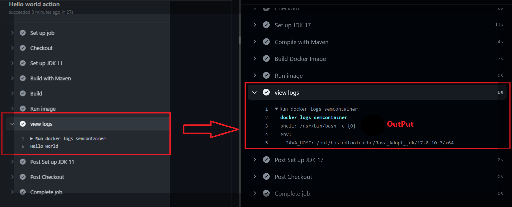

  <h1 align="center">Bug Report</h1>

**Bug 1**

The bug caused by using the incompatible version of Java which leads to docker openjdk not to run properly.  

**To Reproduce**

1. Create a new project using Java Version "21" in Intellij 
2. Retrieve docker image for openjdk 
3. There will be error message display in the console about using unmatched version of Java.

**Expected behavior**
The project will not be able to continue due to unmatched Java version which is "21".The updated version of docker image does not exist for the process. 

**Screenshots**

<h5 align="center">Display Error</h5>

<h5 align="center">Fixing Bug By Changing Java Version</h5>

<h5 align="center">Fixing Bug By Changing Ubuntu Version</h5>

**Desktop (please complete the following information):**
 - OS: Windows 11/MacOs 
 - IDE: IntelliJ IDEA 
 - Version 2023.3.2 (Ultimate Version)

**Bug Fix:**
 - By changing the version of Ubuntu (20) to (22.04).
 - By changing the Java version of (21) to (17).

**Additional context**

None

**Bug 2**

The bug caused by the Intellij software error which make the maven project disappear from the right side of the project.

**To Reproduce**

1. Perform the fetching from the git.
2. Perform the pulling from the git.
3. Maven Project disappear which is the main bug.
4. It seems to occur whenever the software is eating too much RAM

**Expected behavior**
When it occurs, the top right of the Intellij window which  normally have maven will be disappeared.The project files will changed the color of "yellow".

**Screenshots** 
None

**Desktop (please complete the following information):**
- OS: Windows 11/MacOs
- IDE: IntelliJ IDEA
- Version 2023.3.2 (Ultimate Version)

**Bug Fix**
- Close the Intellij Software.
- Reopen the Intellij Software.
- The maven project icon will be reappeared 
- Load the maven Project 

**Additional context**

None

**Bug 3**

The bug caused by the dependency issue.

**To Reproduce**

1. Navigate to pom.xml 
2. Change one of the dependency versions
3. Red line indicating that dependency has not been installed.

**Expected behavior**
The GitHub action will fail and the program will not run successfully.

**Screenshots** 

<h5 align="center">Dependency Issue Error</h5>

**Desktop (please complete the following information):**
- OS: Windows 11/MacOs
- IDE: IntelliJ IDEA
- Version 2023.3.2 (Ultimate Version)

**Bug Fix**
- Click on Maven Icon from the right side 
- Click on reload icon which will reload all the maven project.
- The missing dependency should be installed automatically.

**Additional context**

None

**Bug 4**

The bug caused by misconfiguration from the user side.

**To Reproduce**

1. Delete the necessary file extensions/name from Dockerfile.

**Expected behavior**

The maven package and dockerfile cannot be run correctly which cause the sql cannot be able to connected.

**Screenshots** 

<h5 align="center">Misconfiguration Error</h5>

<h5 align="center">Misconfiguration Error Solved</h5>

**Desktop (please complete the following information):**
- OS: Windows 11/MacOs
- IDE: IntelliJ IDEA
- Version 2023.3.2 (Ultimate Version)

**Bug Fix**
- Open Dockerfile 
- Add necessary file extension/names.

**Additional context**

None

**Bug 5**

The bug caused by directing wrong path copy file location for dataset.

**To Reproduce**

1. By directing to full path file location.
2. Display red line error in log.

**Expected behavior**
The red line error in the log identifying that no sources were specified because of full path file location.

**Screenshots** 

<h5 align="center">Full Filepath Location</h5>

<h5 align="center">Error In Log</h5>

<h5 align="center">Relative Filepath Location</h5>

**Desktop (please complete the following information):**
- OS: Windows 11/MacOs
- IDE: IntelliJ IDEA
- Version 2023.3.2 (Ultimate Version)

**Bug Fix**
- Change the full filepath location into relative filepath location.

**Additional context**

None

**Bug 6**

The bug caused by directing wrong path copy file location for dataset.

**To Reproduce**

1. By directing to full path file location.
2. Display red line error in log.

**Expected behavior**
The red line error in the log identifying that no sources were specified because of full path file location.

**Screenshots** 

<h5 align="center">Full Path File Location</h5>

<h5 align="center">Error In Log</h5>

**Desktop (please complete the following information):**
- OS: Windows 11/MacOs
- IDE: IntelliJ IDEA
- Version 2023.3.2 (Ultimate Version)

**Bug Fix**
- Change the full filepath location into relative filepath location.

**Additional context**

None

**Bug 7**

The bug caused by merge collision where the files disappeared.

**To Reproduce**

1. Check out to one of the branches. 
2. Click Merge to their respective main branch 
3. Merge Collision will occur.
4. Resolve the collision.
5. Some coding/files will disappear. 

**Expected behavior**
When the bug occurs, the program will not run due to lack of necessary files. 

**Screenshots** 

<h5 align="center">Merge</h5>

**Desktop (please complete the following information):**
- OS: Windows 11/MacOs
- IDE: IntelliJ IDEA
- Version 2023.3.2 (Ultimate Version)

**Bug Fix**
- Recreate and add the missing coding and files.

**Additional context**

None

**Bug 8**

The bug caused by port issue in MAC devices when using localhost.

**To Reproduce**

1. Open the necessary files which contain the port number.
2. Change the port number to 33060:3306.
3. Redline appears in log about unavailable port.

**Expected behavior**
The program will not be able to run in Localhost on MAC devices.

**Screenshots** 

<h5 align="center">Port Issue Error</h5>

**Desktop (please complete the following information):**
- OS: MacOs
- IDE: IntelliJ IDEA
- Version 2023.3.2 (Ultimate Version)

**Bug Fix**
- Change the port number to 33061 in the files that mentioned port number.

**Additional context**

None

