# Project Status
* Master Build Status 
* Develop Build Status 
* License 
* Release 
* Code Coverage 
* Kanban/Sprint board [Zube](https://zube.io/group-1-2/group-1/w/workspace-1/sprints)

# Members list
| Team members     | Contact                   | Roles            |
|------------------|---------------------------|------------------|
| S’ Thar Htet     | 40667691@live.napier.ac.uk| Product Owner    |
| Aye Khit Bo      | 40667671@live.napier.ac.uk| Scrum Master     |
| Ye’ Win Thant    | 40667685@live.napier.ac.uk| Lab and Tech Lead|
| Han Htike Soe    | 40667702@live.napier.ac.uk| Lab and Tech Lead|
| Mya Phoo Nyo     | 40632025@live.napier.ac.uk| Documentation    |
| Phyo Min Thaw    | 40667682@live.napier.ac.uk| Documentation    |

# Members Contribution
| Members                  | Code Review 1 | Code Review 2 | Code Review 3 | Code Review 4 | Code Review 5 |
|--------------------------|---------------|---------------|---------------|---------------|---------------|
| S' Thar Htet (40667691)  | 16.6%         | 16.6%         | 16.6%         | 20.0%         | 16.6%         |
| Ye' Win Thant (40667685) | 16.6%         | 16.6%         | 16.6%         | 10.0%         | 16.6%         |
| Han Htike Soe (40667702) | 16.6%         | 16.6%         | 16.6%         | 30.0%         | 16.6%         |
| Phyo Min Thaw (40667682) | 16.6%         | 16.6%         | 16.6%         | 10.0%         | 16.6%         |
| Mya Phoo Nyo (40632025)  | 16.6%         | 16.6%         | 16.6%         | 20.0%         | 16.6%         |
| Aye Khit Bo (40667671)   | 16.6%         | 16.6%         | 16.6%         | 10.0%         | 16.6%         |

# Features Developed
The table below describes the features that have been developed for the project. The full output can be seen in GitHub Actions.

| ID | Features                                                                                                                                                               | Met | Screenshots                                                     |
|----|------------------------------------------------------------------------------------------------------------------------------------------------------------------------|-----|-----------------------------------------------------------------|
| 1  | All the countries in the world organized by largest population to smallest                                                                                             | Yes | [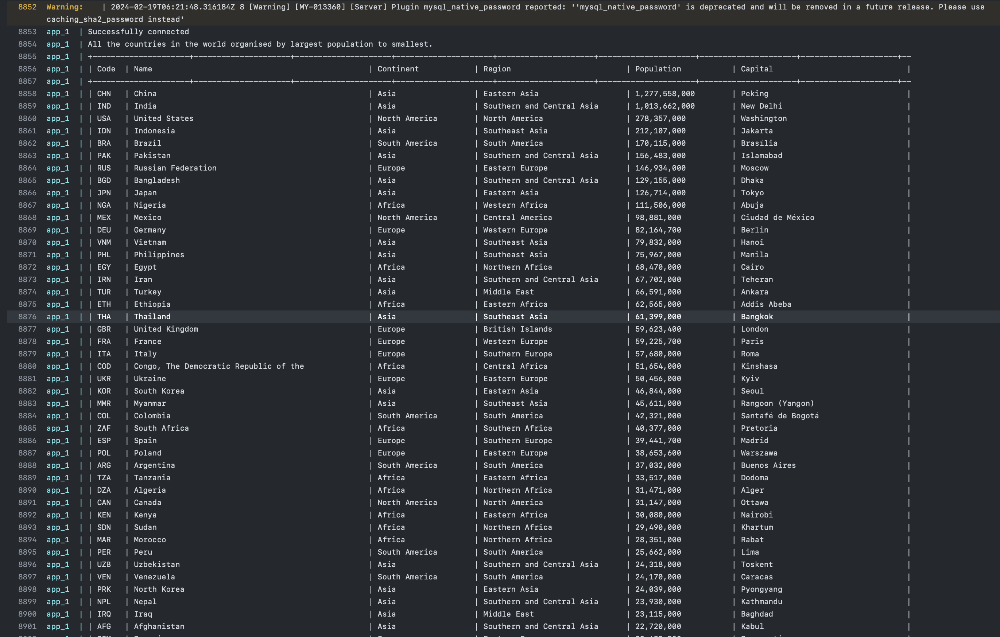](final_output/img12.png) |
| 2  | All the countries in a continent organized by largest population to smallest                                                                                           | Yes    | [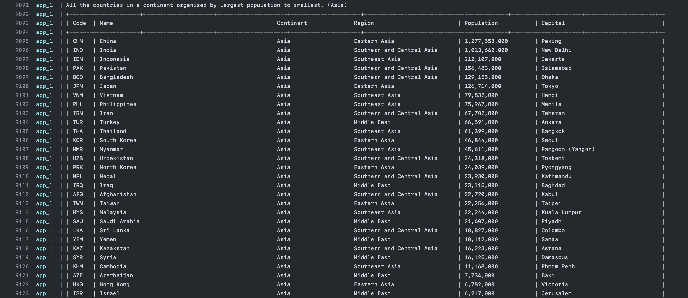](final_output/img13.png) |
| 3  | All the countries in a region organized by largest population to smallest                                                                                              | Yes    | [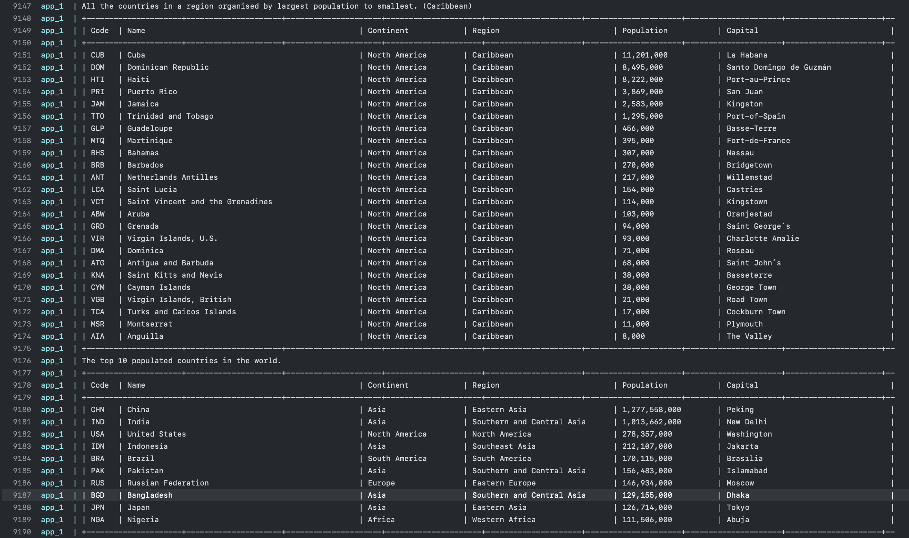](final_output/img14.png) |
| 4  | The top N populated countries in the world (N provided by the user)                                                                                                    | Yes    |  |
| 5  | The top N populated countries in a continent (N provided by the user)                                                                                                  | Yes    | [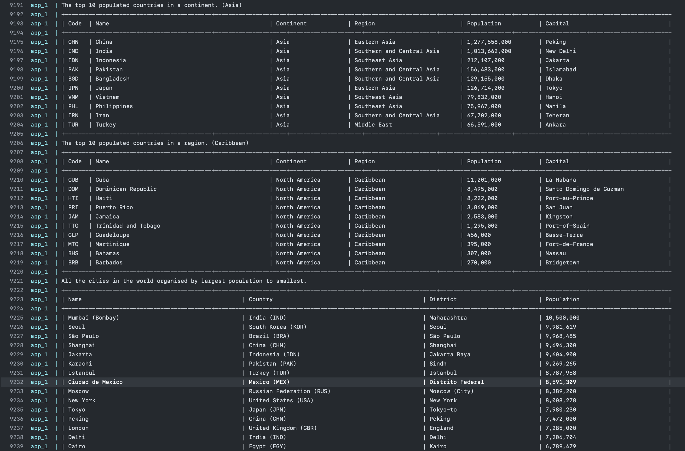](final_output/img15.png) |
| 6  | The top N populated countries in a region (N provided by the user)                                                                                                     | Yes    |  |
| 7  | All the cities in the world organized by largest population to smallest                                                                                                | Yes    |  |
| 8  | All the cities in a continent organized by largest population to smallest                                                                                              | Yes    | [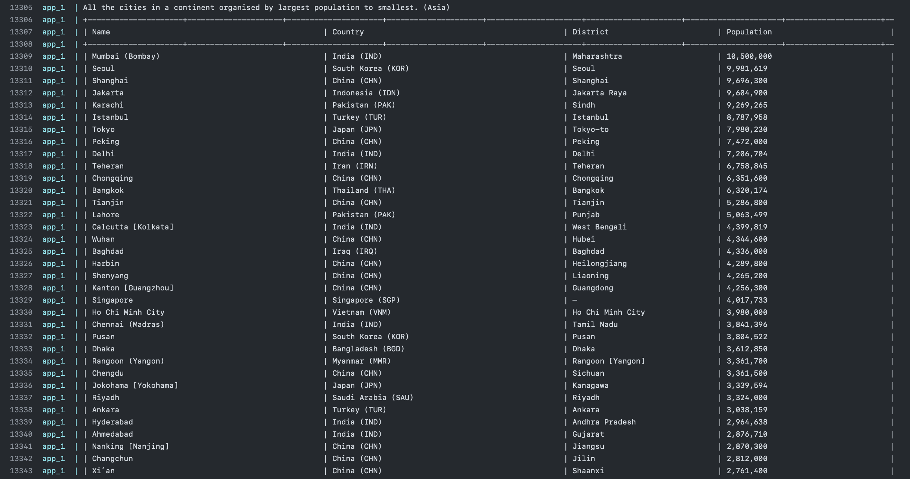](final_output/img16.png) |
| 9  | All the cities in a region organized by largest population to smallest                                                                                                 | Yes    | [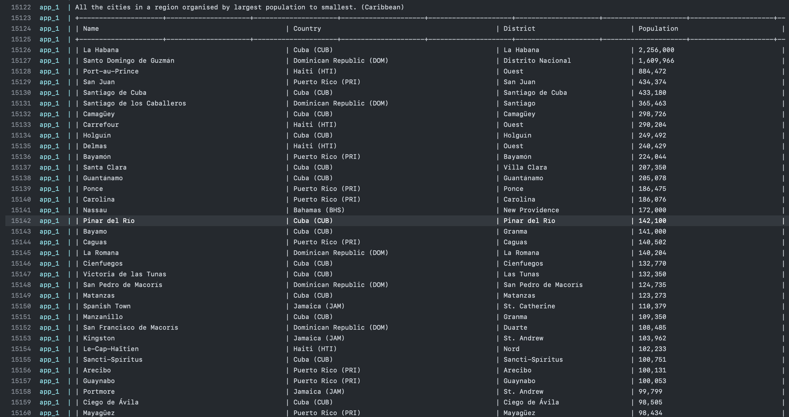](final_output/img17.png) |
| 10 | All the cities in a country organized by largest population to smallest                                                                                                | Yes    | [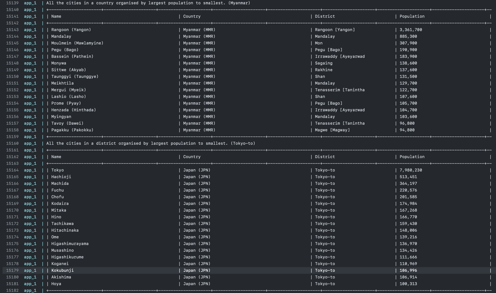](final_output/img18.png) |
| 11 | All the cities in a district organized by largest population to smallest                                                                                               | Yes    |  |
| 12 | The top N populated cities in the world (N provided by the user)                                                                                                       | Yes    | [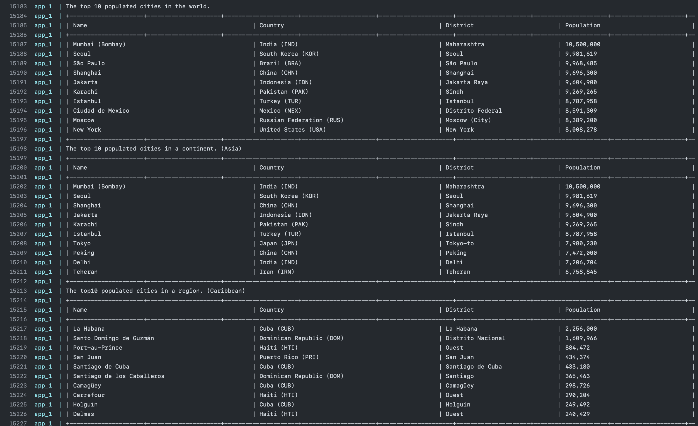](final_output/img19.png) |
| 13 | The top N populated cities in a continent (N provided by the user)                                                                                                     | Yes    |  |
| 14 | The top N populated cities in a region (N provided by the user)                                                                                                        | Yes    |  |
| 15 | The top N populated cities in a country (N provided by the user)                                                                                                       | Yes    | [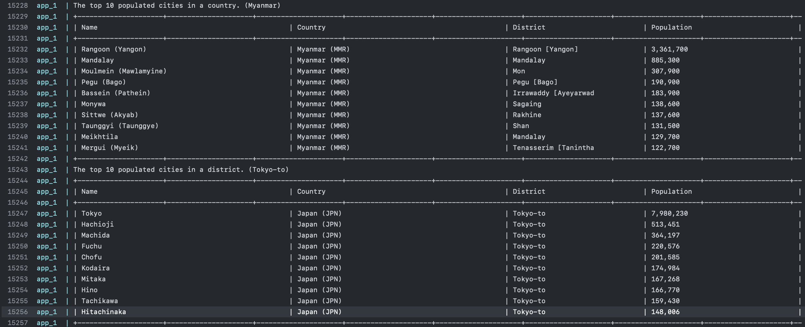](final_output/img20.png) |
| 16 | The top N populated cities in a district (N provided by the user)                                                                                                      | Yes    |  |
| 17 | All the capital cities in the world organized by largest population to smallest                                                                                        | Yes    | [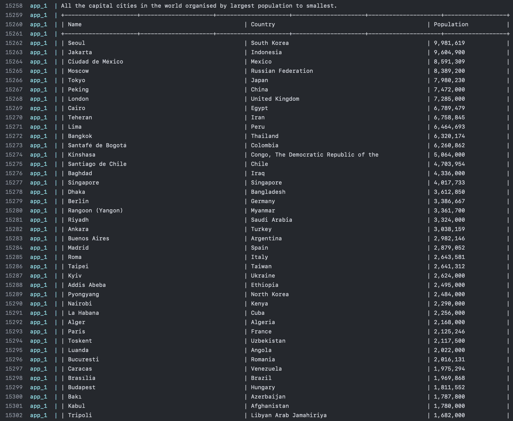](final_output/img21.png) |
| 18 | All the capital cities in a continent organized by largest population to smallest                                                                                      | Yes    | [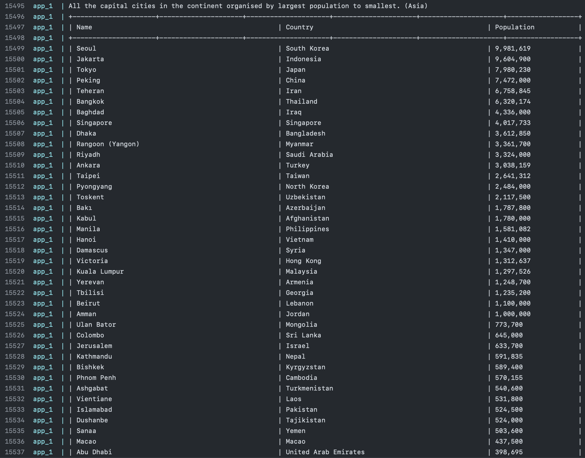](final_output/img22.png) |
| 19 | All the capital cities in a region organized by largest to smallest                                                                                                    | Yes    | [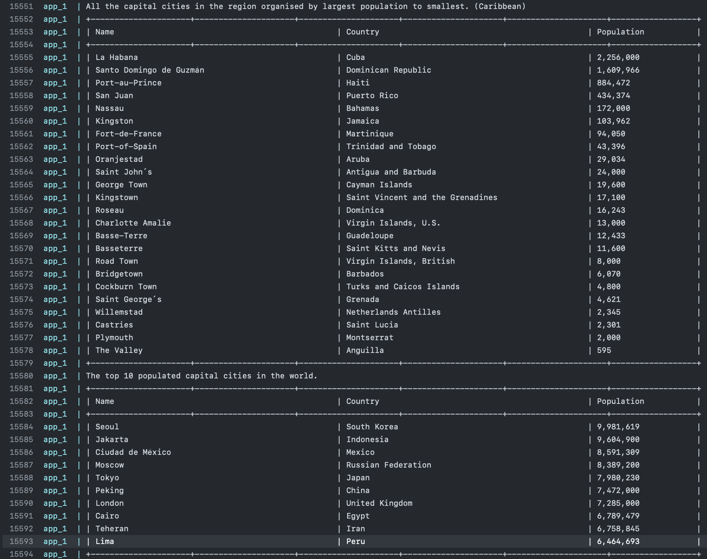](final_output/img23.png) |
| 20 | The top N populated capital cities in the world (N provided by the user)                                                                                               | Yes    |  |
| 21 | The top N populated capital cities in a continent (N provided by the user)                                                                                             | Yes    | [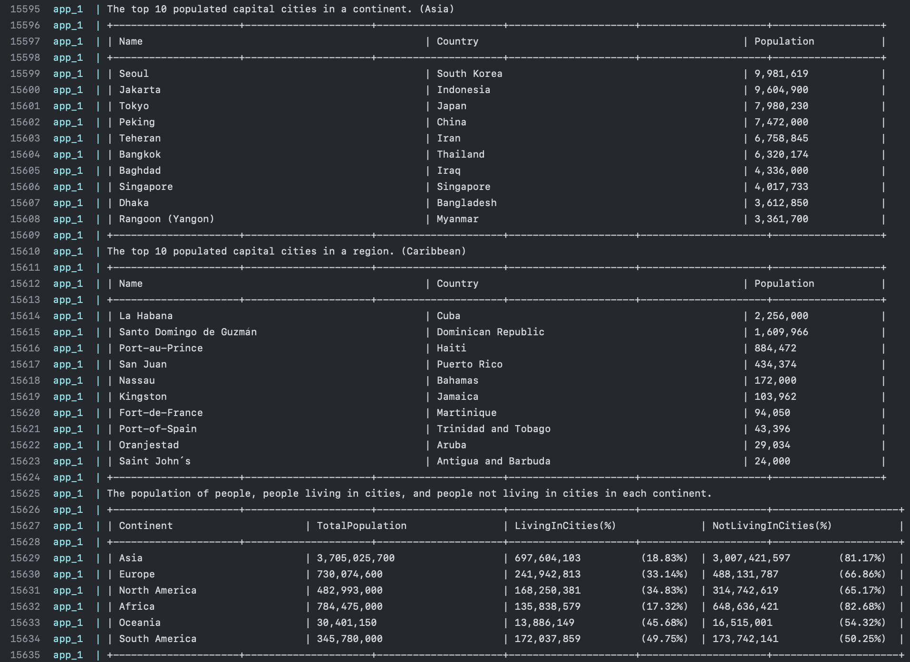](final_output/img24.png) |
| 22 | The top N populated capital cities in a region (N provided by the user)                                                                                                | Yes    |  |
| 23 | Population of people, people living in cities, and people not living in cities in each continent                                                                       | Yes    |  |
| 24 | Population of people, people living in cities, and people not living in cities in each region                                                                          | Yes    | [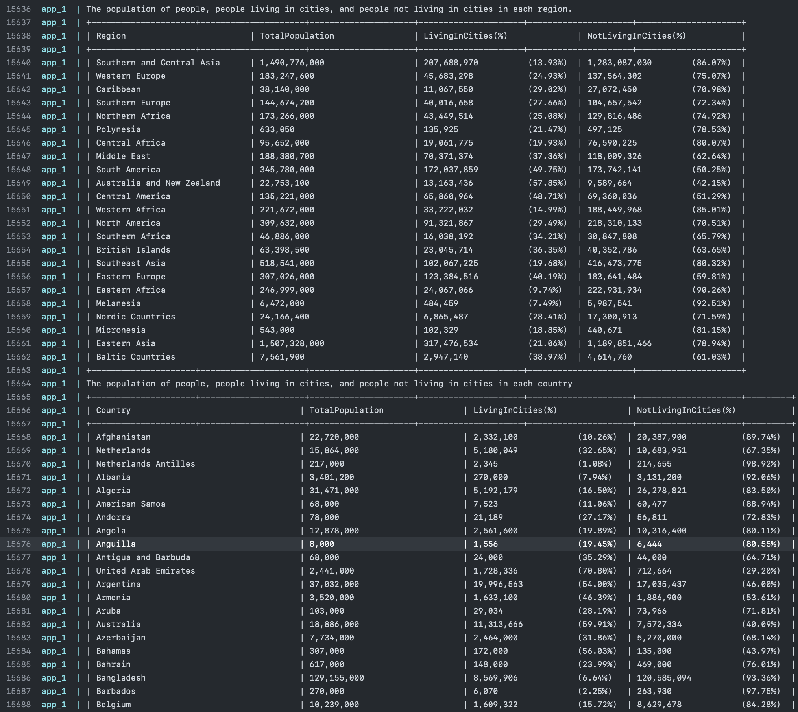](final_output/img25.png) |
| 25 | Population of people, people living in cities, and people not living in cities in each country                                                                         | Yes    |  |
| 26 | Population of the world                                                                                                                                                | Yes    | [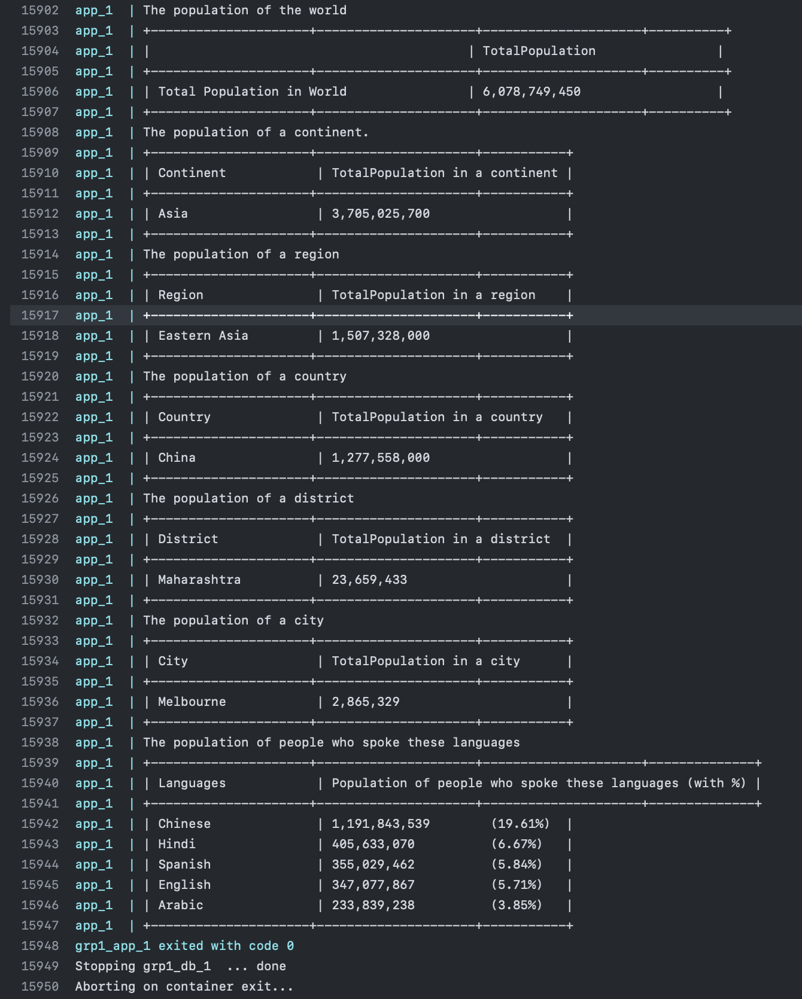](final_output/img26.png) |
| 27 | Population of a continent                                                                                                                                              | Yes    |  |
| 28 | Population of a region                                                                                                                                                 | Yes    |  |
| 29 | Population of a country                                                                                                                                                | Yes    |  |
| 30 | Population of a district                                                                                                                                               | Yes    |  |
| 31 | Population of a city                                                                                                                                                   | Yes    |  |
| 32 | Number of people who speaks the languages (Chinese, English, Hindi, Spanish, Arabic) sorted from greatest number to smallest, including percentage of world population | Yes    |  |

